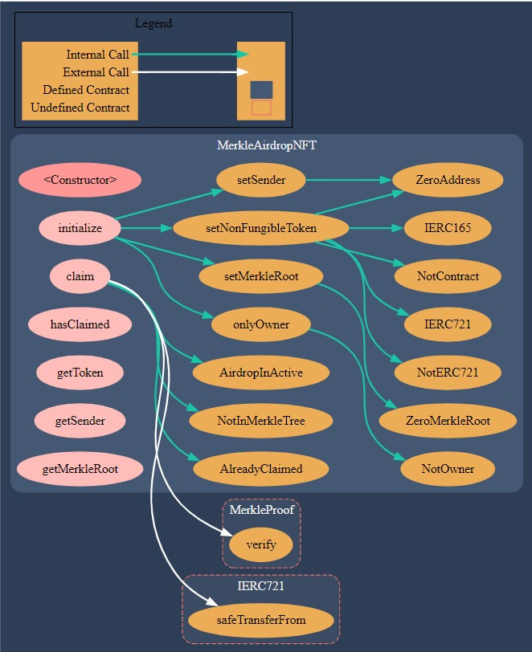

# Airdrop crypto using merkle proof

## About

MerkleAirdrop is contract that allows recepients to claim NFT's via merkle airdrop if they prove that they are a part of the merkle tree.

<!-- Generate merkle tree using [merkle-tree-generator](./scripts/merkle-tree-generator.ts), by passing in a list of recepients (refer [airdrop.json](./airdrop.json)). -->

<!-- ### Contract structure -->

<!--  -->

<!-- ## Testing on Goerli testnet

MerkleAirdrop.sol deployed at: [0x764b971348f0571E8BCF2Ea2AdBB7E793d93B145](https://goerli.etherscan.io/address/0x764b971348f0571E8BCF2Ea2AdBB7E793d93B145#code)

TokenXP.sol deployed at: [0xa7Bb5dFF539912fD2a1D06c90d036B88518694CC](https://goerli.etherscan.io/address/0xa7Bb5dFF539912fD2a1D06c90d036B88518694CC#code)

MerkleAirdrop has been initialized with

```code
{
    sender: "",
    token: "",
    merkleRoot: ""
}
```

The following recepients have been added to merkle tree

```code
{
    "accounts": []
}
``` -->

## Installation

Install the necessary dependencies mentioned in [package.json](./package.json)

```console
npm install
```

## Usage

### Clean

Delete the smart contract artifacts, the coverage reports and the Hardhat cache

```console
npx hardhat clean
```

### Compile

Compile the contracts and generate typechain types

```console
npx hardhat compile
```

### Test

Run testcases for the smart contracts

```console
npx hardhat test
```

### Contract Size

Generate smart contract size

```console
npx hardhat size-contracts
```

### Coverage

Generate coverage reports for the smart contract

```console
npx hardhat coverage
```

### Deploy

-   Environment variables: Create a `.env` file with values as in [.env.example](./.env.example)

#### localhost

Run hardhat node in one terminal and run the deploy script in another terminal.

```console
npx hardhat node
```

```console
npx hardhat run scripts/deploy.ts --network <network>
```

#### Goerli Testnet

-   Install [Truffle](https://trufflesuite.com/docs/truffle/how-to/use-the-truffle-dashboard/) `npm install -g truffle`
-   Run `truffle dashboard` on one terminal
-   Truffle dashboard will open up on `http://localhost:24012/rpc`
-   Connect wallet and switch to Goerli test network
-   Run the deploy script in another terminal

```console
npx hardhat run scripts/deploy.ts --network truffle
```

### Flatten

```console
npx hardhat flatten ./contracts/Contract.sol > ./flattened/Contract.sol
```

Then, the file can be used to upload the code manually (click on 'Contract' tab >> verify and publish) or using script (with Block explorer API as per the network)

### Verify and Publish

Passing constructor params as command line arguments if any exists

```console
npx hardhat verify --network <network_name> <deployed_contract_address> <constructor params>
```

OR

Passing a file with constructor params to --constructor args flag

```console
npx hardhat verify --network <network_name> <deployed_contract_address> --constructor-args verify/contract.args.ts
```

For multiple arguments, follow this [guide](https://hardhat.org/plugins/nomiclabs-hardhat-etherscan.html#multiple-api-keys-and-alternative-block-explorers).

<!-- ## Reports

Checkout [Reports.md](./Reports.md) -->
